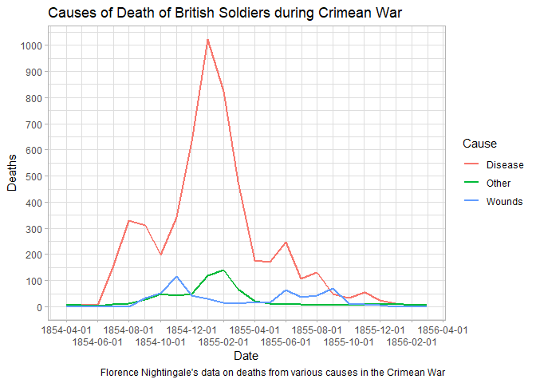
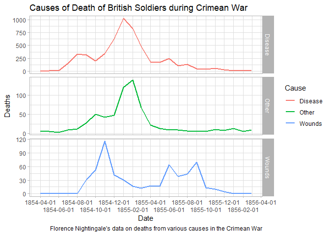
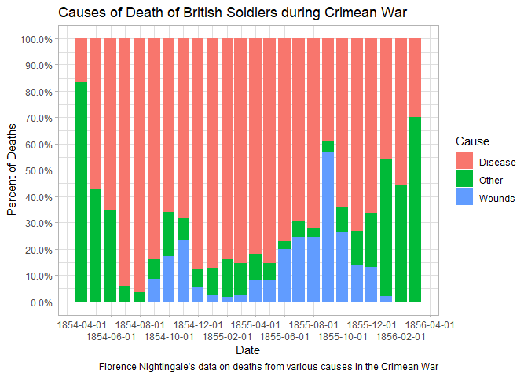

## Module 10 Assignment Instructions

Review the reading resources and post on your blog a new entry with your work with ggplot2 and time series (try yourself) and discuss the input of visualization on time series analysis.

## My Data

For this assignment, I am using the Nightingale dataset. Here is the description of the data:

**********************

## Florence Nightingale's data on deaths from various causes in the Crimean War
Description
In the history of data visualization, Florence Nightingale is best remembered for her role as a social activist and her view that statistical data, presented in charts and diagrams, could be used as powerful arguments for medical reform.

After witnessing deplorable sanitary conditions in the Crimea, she wrote several influential texts (Nightingale, 1858, 1859), including polar-area graphs (sometimes called "Coxcombs" or rose diagrams), showing the number of deaths in the Crimean from battle compared to disease or preventable causes that could be reduced by better battlefield nursing care.

Her Diagram of the Causes of Mortality in the Army in the East showed that most of the British soldiers who died during the Crimean War died of sickness rather than of wounds or other causes. It also showed that the death rate was higher in the first year of the war, before a Sanitary Commissioners arrived in March 1855 to improve hygiene in the camps and hospitals.

Usage
data(Nightingale)
Format
A data frame with 24 observations on the following 10 variables.

Date
a Date, composed as as.Date(paste(Year, Month, 1, sep='-'), "%Y-%b-%d")

Month
Month of the Crimean War, an ordered factor

Year
Year of the Crimean War

Army
Estimated average monthly strength of the British army

Disease
Number of deaths from preventable or mitagable zymotic diseases

Wounds
Number of deaths directly from battle wounds

Other
Number of deaths from other causes

Disease.rate
Annual rate of deaths from preventable or mitagable zymotic diseases, per 1000

Wounds.rate
Annual rate of deaths directly from battle wounds, per 1000

Other.rate
Annual rate of deaths from other causes, per 1000

Details
For a given cause of death, D, annual rates per 1000 are calculated as 12 * 1000 * D / Army, rounded to 1 decimal.

The two panels of Nightingale's Coxcomb correspond to dates before and after March 1855

Source
The data were obtained from:

Pearson, M. and Short, I. (2007). Understanding Uncertainty: Mathematics of the Coxcomb. http://understandinguncertainty.org/node/214.

References
Nightingale, F. (1858) Notes on Matters Affecting the Health, Efficiency, and Hospital Administration of the British Army Harrison and Sons, 1858

Nightingale, F. (1859) A Contribution to the Sanitary History of the British Army during the Late War with Russia London: John W. Parker and Son.

Small, H. (1998) Florence Nightingale's statistical diagrams http://www.florence-nightingale-avenging-angel.co.uk/GraphicsPaper/Graphics.htm

Pearson, M. and Short, I. (2008) Nightingale's Rose (flash animation). http://understandinguncertainty.org/files/animations/Nightingale11/Nightingale1.html

*********************
The above information can also be found here: https://vincentarelbundock.github.io/Rdatasets/doc/HistData/Nightingale.html

*********************

## Reading and Cleaning the Data

To start, let's read in the data and look at the first 6 rows.


```r
Nightingale <- read.csv("Nightingale.csv")
head(Nightingale)
```

```
##   X       Date Month Year  Army Disease Wounds Other Disease.rate Wounds.rate
## 1 1 1854-04-01   Apr 1854  8571       1      0     5          1.4         0.0
## 2 2 1854-05-01   May 1854 23333      12      0     9          6.2         0.0
## 3 3 1854-06-01   Jun 1854 28333      11      0     6          4.7         0.0
## 4 4 1854-07-01   Jul 1854 28722     359      0    23        150.0         0.0
## 5 5 1854-08-01   Aug 1854 30246     828      1    30        328.5         0.4
## 6 6 1854-09-01   Sep 1854 30290     788     81    70        312.2        32.1
##   Other.rate
## 1        7.0
## 2        4.6
## 3        2.5
## 4        9.6
## 5       11.9
## 6       27.7
```

The first column is simply a row count, and can be removed.
The Date is currently stored as a character, let's convert it to a date format.


```r
Nightingale <- Nightingale[,-1]
Nightingale$Date <- as.Date(Nightingale$Date)
head(Nightingale)
```

```
##         Date Month Year  Army Disease Wounds Other Disease.rate Wounds.rate
## 1 1854-04-01   Apr 1854  8571       1      0     5          1.4         0.0
## 2 1854-05-01   May 1854 23333      12      0     9          6.2         0.0
## 3 1854-06-01   Jun 1854 28333      11      0     6          4.7         0.0
## 4 1854-07-01   Jul 1854 28722     359      0    23        150.0         0.0
## 5 1854-08-01   Aug 1854 30246     828      1    30        328.5         0.4
## 6 1854-09-01   Sep 1854 30290     788     81    70        312.2        32.1
##   Other.rate
## 1        7.0
## 2        4.6
## 3        2.5
## 4        9.6
## 5       11.9
## 6       27.7
```

Now, I'm going to convert this to a long form so that it is easier to plot. For this, I will use the melt functions from the reshape2 package.

First, I am narrowing the dataset to just the death rates and then melting this to long data.


```r
library(reshape2)
Night <- Nightingale[,c(1,8:10)]
melted <- melt(Night, "Date")
names(melted) <- c("Date", "Cause", "Deaths")
melted$Cause <- sub("\\.rate", "", melted$Cause)
Night <- melted
```


## Plotting the Data

For the plots, I am using the ggplot2 package.


```r
library(ggplot2)
```

```
## Warning in register(): Can't find generic `scale_type` in package ggplot2 to
## register S3 method.
```

```r
library(scales)
```

First, a line graph.


```r
ggplot(Night, aes(Date,Deaths, color = Cause)) +
  geom_line(size = 1) +
  scale_x_date(date_breaks = "2 months", guide = guide_axis(n.dodge = 2)) +
  scale_y_continuous(n.breaks = 10)+
  theme_light() +
  labs(title = "Causes of Death of British Soldiers during Crimean War", caption = "Florence Nightingale's data on deaths from various causes in the Crimean War")
```

<!-- -->

Let's split this up by cause.


```r
ggplot(Night, aes(Date,Deaths, color = Cause)) +
  geom_line(size = 1) +
  scale_x_date(date_breaks = "2 months", guide = guide_axis(n.dodge = 2)) +
  scale_y_continuous(n.breaks = 5)+
  theme_light() +
  facet_grid(rows = vars(Cause), scales = "free")+
  labs(title = "Causes of Death of British Soldiers during Crimean War", caption = "Florence Nightingale's data on deaths from various causes in the Crimean War")
```

<!-- -->

Finally, let's look at a bar chart version.


```r
ggplot(Night, aes(Date,Deaths, fill = Cause)) +
  geom_col(position = "fill") +
  scale_x_date(date_breaks = "2 months", guide = guide_axis(n.dodge = 2)) +
  scale_y_continuous(labels = percent, n.breaks = 10)+
  theme_light() +
  labs(title = "Causes of Death of British Soldiers during Crimean War", caption = "Florence Nightingale's data on deaths from various causes in the Crimean War", y = "Percent of Deaths")
```

<!-- -->

